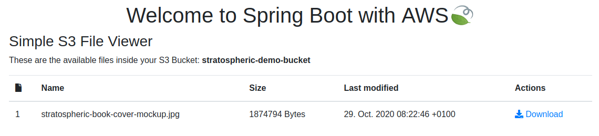

# Getting Started with Spring Boot on AWS

[](https://stratospheric.dev)

**UPDATE**: As Spring Cloud AWS is [no longer part of the Spring Cloud release train](https://spring.io/blog/2020/04/17/spring-cloud-2020-0-0-m1-released), the sample application has been migrated to the successor [awspring](https://awspring.io/). Read more about the rationale behind this move [here](https://maciejwalkowiak.com/blog/spring-cloud-aws-2-3-rc2-released/).

## How to run the demo application

1. Make sure you have the AWS CLI installed and [configured](https://docs.aws.amazon.com/cli/latest/userguide/cli-configure-profiles.html) a `stratospheric` profile with the correct credentials and AWS region e.g.:

Content of `~/.aws/config`:
```
[default]
region = eu-central-1

[profile stratospheric]
region = eu-central-1
```

Content of `~/.aws/credentials`:

```
[default]
aws_access_key_id=DEFAULT_KEY
aws_secret_access_key=DEFAULT_SECRET

[stratospheric]
aws_access_key_id=XYZ
aws_secret_access_key=XYZ
```

2. Ensure you have JDK 11 installed: `java -version`
3. Create the required infrastructure for the application:
```
cd cloudformation
./create.sh your-unique-bucket-name
```

Please note that for demonstration purposes the S3 Bucket and its content is publicly accessible. Remove it afterwards.

4. Create at least the following two parameters using the AWS Parameter Store (inside SSM):

```
/config/stratospheric-demo/custom.bucket-name -> the S3 bucket name you passed to ./create.sh
/config/stratospheric-demo/custom.sqs-queue-name -> stratospheric-demo-queue
```

The parameter values can be either `String` or `SecureString`

5. Start the application on your local machine:
```
./gradlew bootRun
```
6. Upload the demo images to your S3 bucket (make sure to replace `your-unique-bucket-name`)
```
aws s3api put-object --bucket your-unique-bucket-name --key stratospheric-book.pdf --body docs/stratospheric-book.pdf --acl public-read --profile stratospheric
aws s3api put-object --bucket your-unique-bucket-name --key stratospheric-book-cover.jpg --body docs/stratospheric-book-cover.jpg --acl public-read --profile stratospheric
aws s3api put-object --bucket your-unique-bucket-name --key stratospheric-book-cover-mockup.jpg --body docs/stratospheric-book-cover-mockup.jpg --acl public-read --profile stratospheric
```
7. Visit http://localhost:8080/ to open the file viewer. In addition to this, you should see incoming log messages from the SQS listener.
8. (Optional) Build and run the application inside a Docker Container
```
./gradlew assemble
docker build -t statospheric-demo .
docker run -p 8080:8080 -e AWS_REGION=eu-central-1 -e AWS_ACCESS_KEY_ID=XYZ -e AWS_SECRET_KEY=SECRET stratospheric-demo
```

9. Make sure to clean up all AWS resources afterwards. Empty all files within your S3 bucket and then delete the CloudFormation stack inside the AWS console.


## Further resources

- More information about the [Stratospheric project](https://stratospheric.dev)
- Get the E-Book Stratospheric on [Leanpub](https://leanpub.com/stratospheric)
- Spring Cloud AWS on [GitHub](https://github.com/spring-cloud/spring-cloud-aws)
- Spring Cloud AWS [documentation](https://docs.spring.io/spring-cloud-aws/docs/current/reference/html/)
- Maciej Walkowiak's [Spring Academy YouTube channel](https://www.youtube.com/channel/UCslYinLbZnzzUdG0BMaiDKw) with great content about Spring Cloud AWS

## Authors

- [Tom Hombergs](https://reflectoring.io/)
- [Björn Wilmsmann](https://bjoernkw.com/)
- [Philip Riecks](https://rieckpil.de/)
